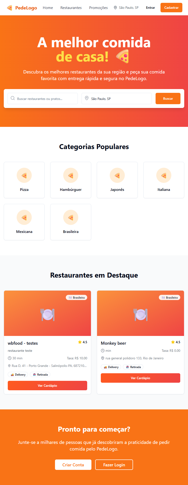
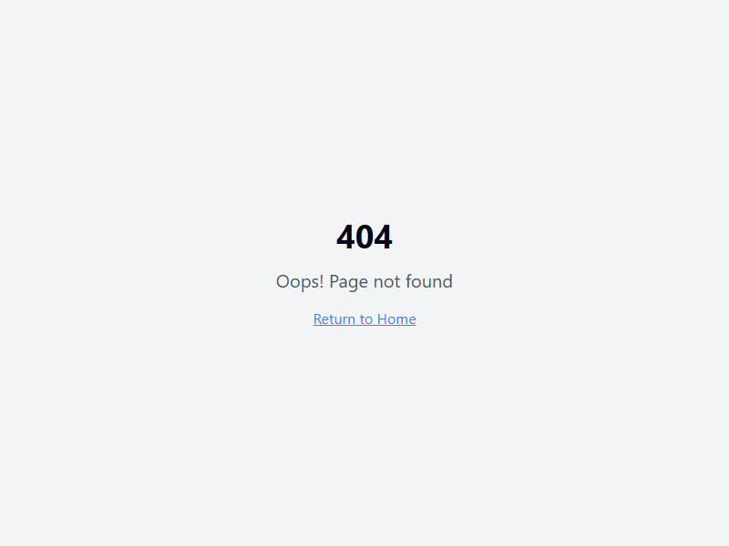

# Fluxo de Navegação do Sistema

Este documento apresenta o fluxo de navegação entre as principais páginas do sistema, ilustrado com screenshots (substitua os exemplos abaixo pelos arquivos reais gerados em docs/screenshots/).

---

## 1. Página Inicial (Index)
- Acesso: http://localhost:8080/
- Possui links para autenticação, cadastro e outras áreas do sistema.

---

## 2. Autenticação (Auth)
- Acesso: http://localhost:8080/auth
- Usuário faz login ou cadastro.
- Após login, redireciona para o dashboard correspondente ao tipo de usuário.

---

## 3. Dashboards

### a) AdminDashboard
- Acesso: http://localhost:8080/admin-dashboard
- Acesso após login como administrador.
- Permite navegação para gerenciamento de restaurantes, usuários, promoções, etc.

### b) ClientDashboard
- Acesso: http://localhost:8080/client-dashboard
- Acesso após login como cliente.
- Permite navegação para lista de restaurantes, pedidos, promoções.

### c) DeliveryDashboard
- Acesso: http://localhost:8080/delivery-dashboard
- Acesso após login como entregador.
- Permite navegação para pedidos em andamento, histórico de entregas.

### d) RestaurantDashboard
- Acesso: http://localhost:8080/restaurant-dashboard
- Acesso após login como restaurante.
- Permite navegação para gerenciamento de cardápio, pedidos, promoções.

---

## 4. Outras Páginas

### a) Lista de Restaurantes
- http://localhost:8080/restaurants
- Acessível pelo dashboard do cliente.

### b) Promoções
- http://localhost:8080/promotions
- Acessível por todos os dashboards.

### c) Reset de Senha
- http://localhost:8080/reset-password
- Acessível a partir da tela de login.

### d) Página Não Encontrada
- http://localhost:8080/404
- Exibida para rotas inválidas.

---

## Fluxo Resumido

1. **Index** → [Login/Cadastro] → **Auth**
2. **Auth** → [Login bem-sucedido]
   - Se admin → **AdminDashboard**
   - Se cliente → **ClientDashboard**
   - Se entregador → **DeliveryDashboard**
   - Se restaurante → **RestaurantDashboard**
3. Dos dashboards, navegação para:
   - **RestaurantsPage** (clientes)
   - **PromotionsPage** (todos)
   - **ResetPassword** (a partir do Auth)
4. Qualquer rota inválida → **NotFound**

---

> Substitua os exemplos de imagens acima pelos screenshots reais gerados. Adapte o fluxo conforme regras específicas do seu sistema.
